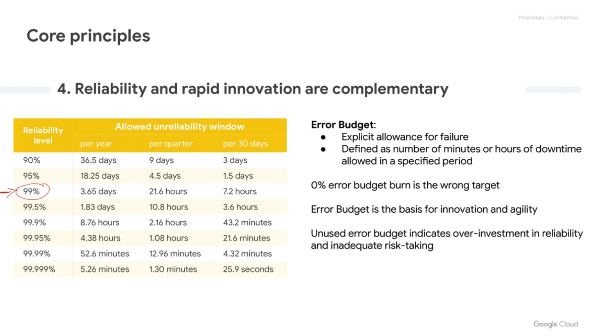

# DevOps Concepts
## Developent / Operations Teams

No compromizing speed and reliability

Site Reliability Engineering == Software Engineering

SRE =/= System Admin

SRE is implimintation of best practices
SRE is DevOps with more focus in reliability

DevOps is a concept

#### Automating Toil Tasks

### Culture of DevOps/SRE

DevOps is a loose set of principles, practices, guidelines and `culture`.

SRE is one how doing implementation of DevOps principles.

### Objectives

#### Psychological safety
Lead to reduce the lead time, deployment frequency and time to restore.

#### Blamelessness, Avoiding "WHO?!"
Do not focus on PEOPLE, focus on SYSTEMS and PROCESSES.

#### Postmortems

Our Code review did not catche it
Our test cases did not cover it.
 
 - Write
 - Review
 - publishize

Best Practices
 - Avoid blameful.
 - Focus on Improvement
 - leverage real-time collaboration

## True Reliability

Reliability == Availability of all components

Availability
99%
99.9%
99.99%
99.999% 
increasing one 9 dublicating the cost x3 - x4 

## Core Concepts

#### 1- Service Level Objectives (SLOs)

Identify the metrics you are interested in
Identify the the thresholds (SLOs)

Metrics + Threshold = (SLOs)

#### 2- Service Level Indicator (SLIs)

The metrics (SLIs)

Metric groups | Metrics
--- | --
Request/Response | availability Latency Quality  
Data Processing | Coverage Correctness 
Storage | Throughput

#### 3- Service Level Agreements (SLAs)
the agreement for what will happen in case of violation of the SLIs and SLOs

#### 4- Critical user Journey (CUJ)

#### 5- Budget for Error: 
 - Allowance to fail.
 - Allowance for app downtime/slowness
 - Error Budget = 100%-SLO

#### 5- Error budget Policy
How you going to response (Action taken) to exhaustion of the error budget.

#### 6- 

